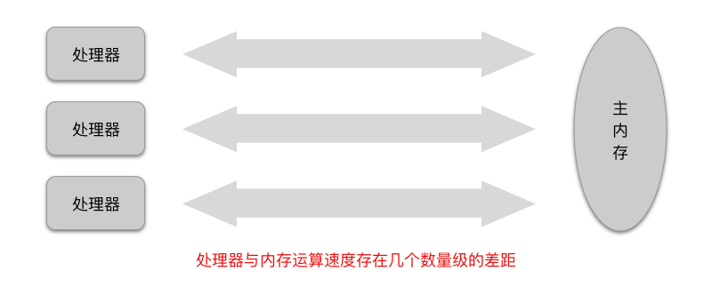
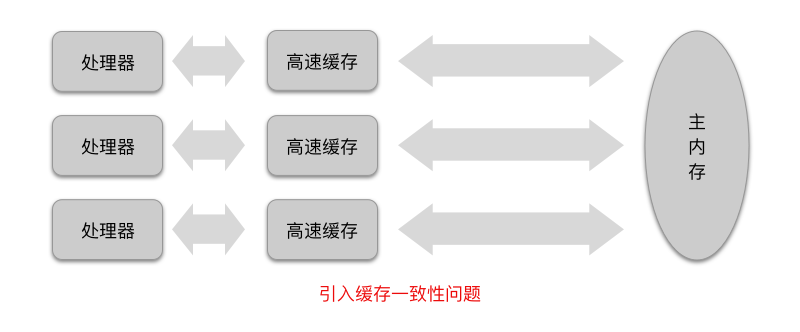
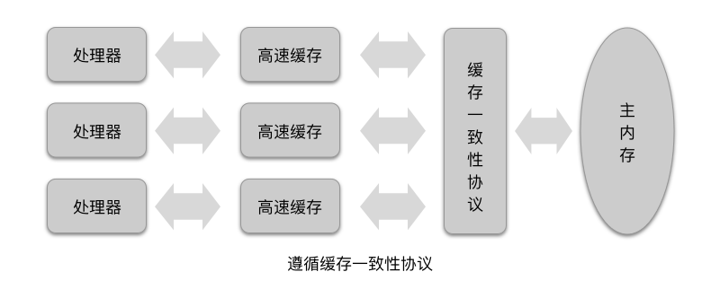

# 《深入理解 Java 虚拟机》笔记 - Java 内存模型与线程

> 摘自 [《深入理解 Java 虚拟机》](https://book.douban.com/subject/24722612) 第 12 章 Java 内存模型与线程。

并发处理的广泛应用是使得 [Amdahl 定律](https://en.wikipedia.org/wiki/Amdahl's_law) 代替 [Moore 定律](https://en.wikipedia.org/wiki/Moore's_law) 成为计算机性能发展源动力的根本原因，也是人类「压榨」计算机运算能力的最有力武器。

## 硬件的效率与一致性

计算机的大部分运算任务都不可能只靠处理器（CPU）计算就能完成。因为大部分情况下，处理器都需要与存储设备（内存）进行交互，例如读取数据、存储运算结果等。

由于计算的 CPU 与内存的运算速度存在几个数量级的差距，所以现代大部分计算机系统都加入了一层读写速度尽可能接近 CPU 运算速度的 [高速缓存（Cache）](https://en.wikipedia.org/wiki/CPU_cache)，用来作为 CPU 和内存的缓冲。这种缓冲的运行机制是：将 CPU 运算所需要使用到的数据复制到缓存中，让运算能快速进行；当运算结束之后再从缓冲同步回内存之中。通过这种方式，CPU 就无需等待对内存的缓慢读写了。

不过这种运行机制也引入了一个新的问题：[缓存一致性（Cache Coherence）](https://en.wikipedia.org/wiki/Cache_coherence)。当多个 CPU 的运算任务都涉及同一块内存区域时，将可能导致 CPU 的寄存器、高速缓存、内存中的数据不一致问题。为了解决内存一致性问题，需要各个 CPU 在访问内存时都遵循一致的协议，在读写数据时需要根据协议来进行操作，类似的协议有 [MSI Protocol](https://en.wikipedia.org/wiki/MSI_protocol)、[MESI Protocol](https://en.wikipedia.org/wiki/MESI_protocol)、[MOSI Protocol](https://en.wikipedia.org/wiki/MOSI_protocol)、[Firefly](https://en.wikipedia.org/wiki/Firefly_(cache_coherence_protocol))、[Dragon Protocol](https://en.wikipedia.org/wiki/Dragon_protocol) 等。

[内存模型（Memory Module）](https://en.wikipedia.org/wiki/Memory_module) 一词可以理解为在特定的操作协议下，计算机对特定的内存或高速缓存进行读写访问的抽象过程。不同架构的物理机器可以拥有不同的内存模型，Java 虚拟机也拥有自己的内存模型。

除了增加高速缓存之外，为了使 CPU 内部的运算单元能尽可能地被充分利用，CPU 还会可能会对输入代码进行 [乱序执行（Out-Of-Order Execution）](https://en.wikipedia.org/wiki/Out-of-order_execution) 优化。CPU 会在计算之后将乱序执行的结果重组，保证该结果与顺序执行的结果是一致的，但并不保证程序中各个语句计算的先后顺序与输入代码中的顺序一致。因此，如果存在一个计算任务依赖另一个计算任务的中间结果，那么其顺序性并不能靠代码的先后顺序来保证。与 CPU 的乱序执行优化类似，Java 虚拟机的即时编译（JIT）也有类似的指令重排序（Instruction Reorder）优化。

## Java 内存模型

Java 虚拟机规范中试图定义一种 [Java 内存模型（Java Memory Module）](https://en.wikipedia.org/wiki/Java_memory_model) 来屏蔽各种硬件和操作系统的内存访问差异，以实现让 Java 程序在各种平台下都能达到一致的内存访问效果。

定义 Java 内存模型是一件即严谨又宽松的事情：它必须足够严谨，才能让 Java 的并发访问内存操作不会有歧义；它也必须足够宽松，才能让 Java 虚拟机的实现有足够的自由空间去利用硬件的各种特性（寄存器、高速缓存、指令集的某些特有操作）来获取更好的执行速度。

### 主内存与工作内存

Java 内存模型的主要目标是定义程序中各个变量的访问规则，即 Java 虚拟机将变量存储到内存、从内存中取出变量这样的底层细节。此处的变量与 Java 编程中所说的变量有所区别，它包括了实例字段、静态字段和构成数组对象的元素，但不包括局部变量与方法参数，因为后者是线程私有的，也不会被共享，不会引发竞争问题。

Java 内存模型规定了所有的变量都存储在主内存（Main Memory）中，每个线程拥有自己的工作内存（Working Memory）。每个线程的工作内存中保存了被该线程使用到的变量的主内存副本拷贝，线程对变量的所有操作（读取、赋值等）都必须在工作内存中进行，而不能直接读写主内存中的变量。不同的线程之间也无法直接访问对方工作内存中的变量，线程间变量值的传递均需要通过与主内存交互来完成。

### 内存间交互操作

Java 内存模型定义了 8 种操作来完成主内存与工作内存之间的具体交互协议，即一个变量如何从主内存拷贝到工作内存、如何从工作内存同步回主内存之类的实现细节。实现虚拟机时必须保证下面提及的每种操作都是原子的、不可再分的：

- **lock** 作用于主内存的变量，它把一个变量标识为一个线程独占的状态；
- **unlock** 作用于主内存的变量，它把一个处于锁定状态的变量释放出来，释放后的变量才可以被其它线程锁定；
- **read** 作用于主内存的变量，它把一个变量的值从主内存传输到线程的工作内存中，以便随后的 load 操作使用；
- **load** 作用于工作内存的变量，它把 read 操作从主内存中得到的变量值放入工作内存的变量副本中；
- **use** 作用于工作内存的变量，它把工作内存中一个变量的值传递给执行引擎，每当虚拟机遇到一个需要使用到变量的值的字节码指令时，将会执行这个操作；
- **assign** 作用于工作内存的变量，它把一个从执行引擎接收到的值赋给工作内存的变量，每当虚拟机遇到一个给变量赋值的字节码指令时，执行这个操作；
- **store** 作用于工作内存的变量，它把工作内存中一个变量的值传送到主内存中，以便随后的 write 操作使用；
- **write** 作用于主内存的变量，它把 store 操作从工作内存中得到的变量的值放入主内存的变量中。

### 对于 volatile 型变量的特殊规则

volatile 关键字是 Java 虚拟机提供的最轻量级的同步机制，Java 内存模型对 volatile 专门定义了一些特殊的的访问规则。当一个变量定义为 volatile 之后，它将具备两种特性：

#### 保证此变量对所有线程的可见性

volatile 变量在被赋值之后，将会使当前 CPU 的高速缓存写入内存，并引起其它 CPU 或者内核无效化它们的高速缓存，从而保证了此变量对所有线程的可见性。

volatile 关键字仅保证了被修饰变量对所有线程的可见性，却不能保证此变量的运算在并发操作下的原子性。这是因为在 Java 中的运算并非是原子操作：一行 Java 代码可能被编译（javac）成多条字节码指令，并且一个字节码指令也可能被解释执行成多行代码或者被编译执行成多个机器码指令。这导致了 volatile 变量的运算在并发场景下实际上是不安全的，所以在不符合以下两条规则的运算场景下，我们仍然需要通过加锁（使用 synchronized 或 java.util.concurrent 中的原子类）来保证变量的原子性：

- 运算结果并不以依赖变量的当前值，或者能够确保只有单一的线程修改变量的值；
- 变量不需要与其它的状态变量共同参与不变的约束。

#### 禁止虚拟机的指令重排序优化

volatile 变量在被赋值后，将会多执行一个相当于 [内存屏障（Memory Barrier）](https://en.wikipedia.org/wiki/Memory_barrier)，指令重排序不能把后面的指令重排序到内存屏障之前的位置操作，从而保证了代码执行的有序性。

因为这种机制，所以 volatile 变量在读操作下的性能损耗与普通变量几乎没有什么差别，但是写操作则可能会慢一些，因为它需要在本地代码中插入许多内存屏障指令来保证 CPU 不发生乱序执行。

### 原子性、可见性、有序性

Java 内存模型是围绕着在并发过程中如何处理原子性、可见性、有序性这 3 个特性来建立的，这 3 个特性对应的操作如下：

- 原子性

    由 Java 内存模型直接保证的原子性变量操作包括 read、load、assign、use、store、write，我们大致可以认为基本数据类型的访问读写是具备原子性的。如果应用一个更大范围的原子性保证，Java 内存模型还提供了 lock 和 unlock 操作。尽管虚拟机未把 lock 和 unlock 操作直接开放给用户使用，但是却提供了更高层次的字节码指令 monitorenter 和 monitorexit 来隐式地使用这两个操作。这两个字节码指令对应到 Java 代码中就是同步块——synchronized 关键字，因此 synchronized 块之间的操作也具备原子性。

- 可见性

    可见性是指当一个线程修改了共享变量的值，其它线程能够立即得知这个修改。Java 内存模型是通过 **在变量修改后将新值同步回主内存，在变量读取前从主内存刷新变量值** 这种依赖主内存作为媒介的方式，来实现可见性的。无论是普通变量还是 volatile 变量都是如此，普通变量与 volatile 变量的区别是，volatile 的特殊规则保证了新值能立即同步到主内存，以及每次使用前立即从主内存刷新。

    除了 volatile 关键字之外，Java 还有两个关键字能实现可见性，即 synchronized 和 final。同步块的可见性是由于「对一个变量执行 unlock 操作之前，必须先把此变量同步回主内存中」这条规则获得的。final 关键字的可见性是指：被 final 修饰的字段在构造器中一旦初始化完成，并且构造器没有把 this 的引用传递出去，那在其它线程中就能看见 final 字段的值。

- 有序性

    Java 程序中天然的有序性可以总结为一句话：如果在本线程内观察，所有的操作都是有序的；如果在一个线程中观察另一个线程，所有的操作都是无序的。前半句话是指「线程内表现为串行的语义」，后半句是指「指令重排序」现象和「工作内存与主内存同步延迟」现象。

    Java 语言提供了 volatile 和 synchronized 两个关键字来保证线程之间操作的有序性。volatile 关键字本身就包含了禁止指令重排序的语义，而 synchronized 则是由「一个变量在同一个时刻只允许一条线程对其进行 lock 操作」这条规则获得的。

### 先行发生原则

Java 内存模型中的有序性不仅可以依靠 volatile 和 synchronized，还可以依靠 [先行发生（Happens-before）](https://en.wikipedia.org/wiki/Happened-before) 原则。这个原则很重要，它是判断数据是否存在竞争、线程是否安全的主要依据。依靠这个原则，我们可以通过几条规则一揽子地解决并发环境下两个操作之间是否可能存在冲突的所有问题。

先行发生原则是 Java 内存模型中定义的两项操作之前的偏序关系。如果说操作 A 先行发生于操作 B，其实就是说在发生操作 B 之前，操作 A 产生的影响能被操作 B 观察到，此处的「影响」包括修改了内存中共享变量的值、发送了消息、调用了方法等。

Java 内存模型中存在一些天然的 Happens-before 关系，这些 Happens-before 关系无需任何同步器协助就已经存在，可以在编码中直接使用。如果两个操作之间的关系不在此列，并且无法从下列规则中推导出来的话，它们就没有有序性保障，虚拟机可以对它们随意地进行重排序。

- 程序次序规则

    在一个线程内，按照程序代码顺序书写在前面的操作先行发生于书写在后面的操作。

- 管程锁定规则

    一个 unlock 操作先行发生于后面对同一个锁的 lock 操作。

- volatile 变量规则

    对一个 volatile 变量的写操作先行发生于后面对这个变量的读操作。

- 线程启动规则

    Thread 对象的 `start()` 方法先行发生于此线程的每一个动作。

- 线程终止规则

    线程中的所有操作都先行发生于对此线程的终止检测，可以通过 `Thread.join()`、`Thread.isAlive()` 的返回值等手段检测线程已经终止执行。

- 线程中断规则

    对线程的 `interrupt()` 调用先行发生于被「中断线程的代码检测」到「中断事件的发生」，可以通过 `Thread.inteerupted()` 检测是否有中断发生。

- 对象终结规则

    一个对象的初始化完成（构造方法执行结束）先行发生于它的 `finalize()` 的开始。

- 传递性

    如果操作 A 先行发生于操作 B，操作 B 先行发生于操作 C，那就可以得出操作 A 先行发生于操作 C。

## Java 与线程

### 线程的实现

线程是比进程更轻量级的调度执行单位，Java 语言提供了在不同硬件和操作系统平台下，对线程操作的统一处理，每个已经执行 `start()` 并且还未结束的 `java.lang.Thread` 类的实例就代表了一个线程。

线程的实现主要有三种方式：使用内核线程实现、使用用户线程实现、使用用户线程 + 轻量级进程混合实现。

#### 使用内核线程实现

内核线程（Kernel-Level Thread）就是直接由操作系统内核（Kernel）支持的线程，这种线程由内核来完成线程切换，内核通过操作调度器（Scheduler）对线程进行调度，并负责将线程的任务映射到各个处理器上。

程序一般不会直接去使用内核线程，而是去使用内核线程的一种高级接口——[轻量级进程（Light Weight Process）](https://en.wikipedia.org/wiki/Light-weight_process)。轻量级进程就是我们通常意义上所讲的线程，每个轻量级进程都由一个内核线程支持，只有先支持内核线程，才能有轻量级进程。

由于内核线程的支持，每个轻量级进程都成为一个独立的调度单元，即使一个轻量级进程在调用时阻塞了，也不会影响整个进程的继续工作。但是，轻量级进程也具有它的局限性：

1. 由于轻量级进程是基于内核线程实现的，所以各种线程操作（如创建、析构、同步）都需要进行系统调用，需要在用户态（User Mode）和内核态（Kernel Mode）切换，消耗的代价相对较高；
2. 每个轻量级进程都需要一个内核线程的支持，所以轻量级进程需要消耗一定的内核资源（如内核线程的栈空间），因此一个系统支持的轻量级进程的数量是有限的。

#### 使用用户线程实现

广义上来说，一个线程只要不是内核线程，就可以认为它是用户线程（User Thread）。狭义上来说，用户线程指的是完全建立在用户空间的线程库上，系统内核不能感知线程存在的实现。

用户线程的建立、同步、销毁、调度完全在用户态中完成，不需要内核的帮助。如果程序实现得当，这种线程不需要切换到内核态，因此线程操作可以是非常快速且低消耗的，也可以支持规模更大的线程数量。

使用用户线程的优势在于不需要系统内核的支持，劣势也在于没有系统内核的支持。所有线程操作都需要用户程序自己处理，线程的创建、切换、调度都是需要考虑的问题。诸如「阻塞如何处理」、「多处理器系统中如何将线程映射到其它处理器上」之类问题解决起来将会异常困难，因此使用用户线程实现的程序一般都比较复杂。

#### 使用用户线程 + 轻量级线程进程混合实现

线程除了依赖内核线程实现和完全由用户程序自己实现之外，还有一种将内核线程与用户线程一起使用的实现方式。在这种混合实现下，既存在用户线程，也存在轻量级进程。

用户线程还是完全建立在用户空间中，因此用户线程的创建、切换、析构等操作依然廉价，并且可以支持大规模的用户线程并发。

轻量级进程则作为用户线程和内核线程之间的桥梁，这样可以使用内核提供的线程调度功能及处理器映射，并且用户线程的系统调用要通过轻量级进程来完成，大大降低了整个进程被完全阻塞的风险。

### 线程的调度

[线程调度](https://en.wikipedia.org/wiki/Scheduling_(computing)) 是指系统为线程分配 CPU 使用权的过程，主要调度有两种方式：[协同式线程调度](https://en.wikipedia.org/wiki/Cooperative_multitasking) 和 [抢占式线程调度](https://en.wikipedia.org/wiki/Preemption_(computing))。

使用协同式线程调度时，线程的执行时间是由线程本身控制的。线程把自己的工作执行完成以后，主动通知操作系统切换到另一个线程上。协同式调度的好处是实现简单：线程之间不存在同步问题，坏处是线程执行的时间不可控制：一个线程阻塞将会阻塞整个进程。

使用抢占式线程调度时，线程的执行时间是由操作系统控制的，线程的切换不由线程本身来决定。抢占式调度不会存在一个线程阻塞整个进程的情况，Java 使用的线程调度方式就是抢占式调度。

虽然 Java 线程调度是由系统自动完成的，但其实还是可以通过设置线程的优先级，来「建议」操作系统给某些线程多分配或者少分配些执行时间，例如后台线程 Finalizer 就是一个由虚拟机自动建立的低优先级线程。

### 线程的状态

Java 语言定义了 5 种线程状态：

- 新建 New

    创建后未启动的线程状态。

- 运行 Runnable

    Runnable 状态包括了操作系统线程状态中的 Running 状态和 Ready 状态，也就是说处于 Runnable 状态的线程有可能正在执行任务，也有可能正在等待着 CPU 为它分配执行的时间。

- 期限等待 Waiting

    Waiting 线程不会被分配 CPU 执行时间，它们需要等待被其它线程显示地唤醒。以下方法会让线程进入 Waiting 状态：

    - 没有设置时间的 `Object.wait()`
    - 没有设置时间的 `Thread.join()`
    - `LockSupport.park()`

- 期限等待 Timed Waiting

    Timed Waiting 线程不会被分配 CPU 执行时间，它们会在等待一段时间之后，由系统自动唤醒。以下方法会让线程进入 Timed Waiting 状态：

    - `Thread.sleep()`
    - 设置了时间的 `Object.wait()`
    - 设置了时间的 `Thread.join()`
    - `LockSupport.parkNanos()`
    - `LockSupport.parkUntil()`

- 阻塞 Bloked

    被阻塞的线程状态。「阻塞状态」和「等待状态」的区别是：阻塞状态是在等待着获取一个互斥锁，这个事件将在另外一个线程放弃锁的时候发生；等待状态是在等待一段时间，或者其它线程的唤醒动作。在程序等待进入同步代码块时，线程将进入 Bloked 状态。

- 结束 Terminated

    已终止线程的线程状态。

## 参考资料

- [同步和 Java 内存模型（五）Volatile](http://ifeve.com/syn-jmm-volatile)
- [VisualVM - Thread States](https://stackoverflow.com/questions/27406200/answer/27406503)
