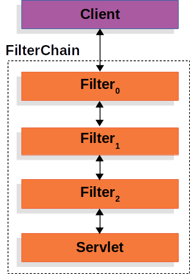
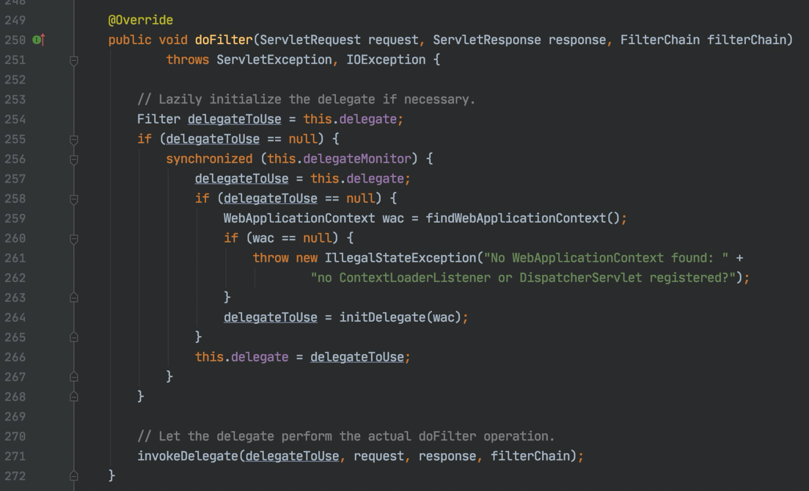
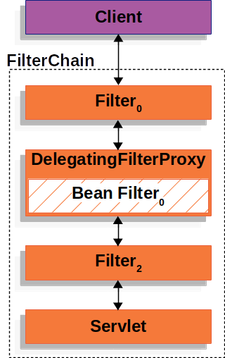
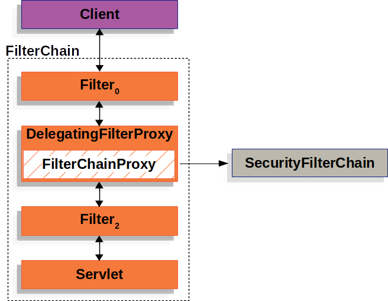
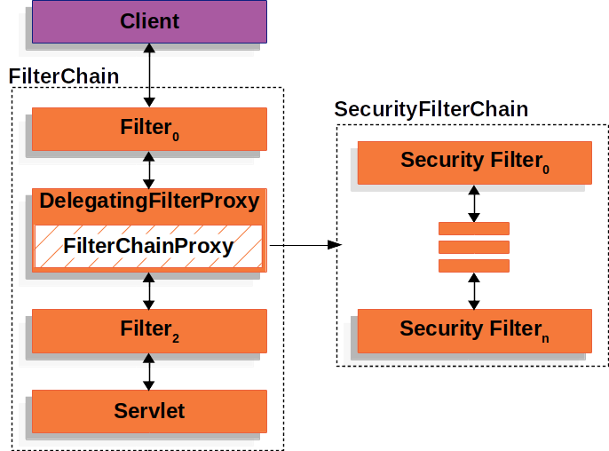
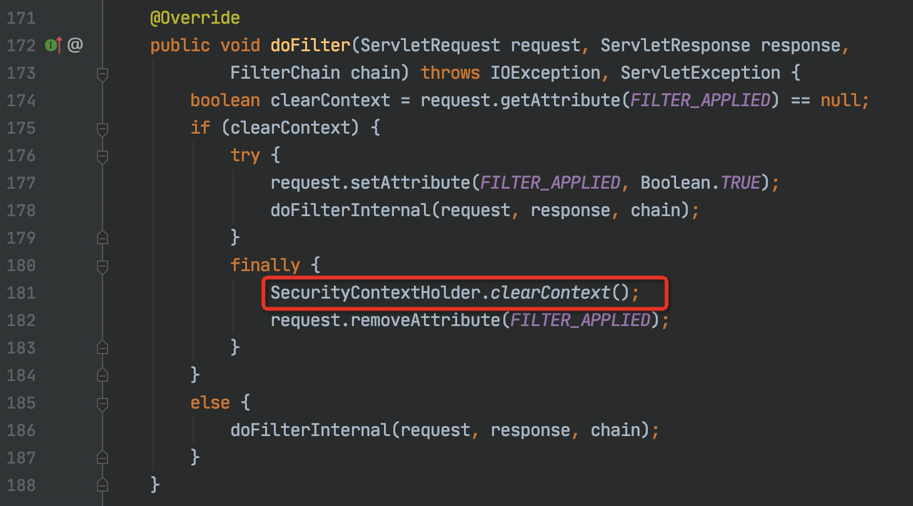
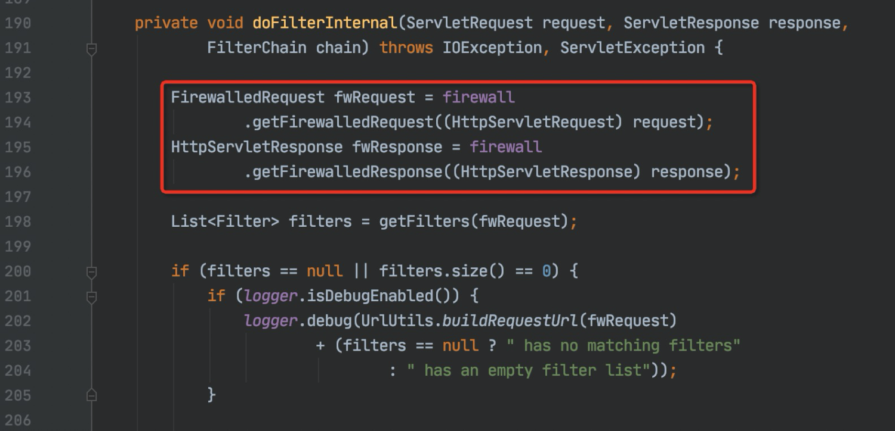
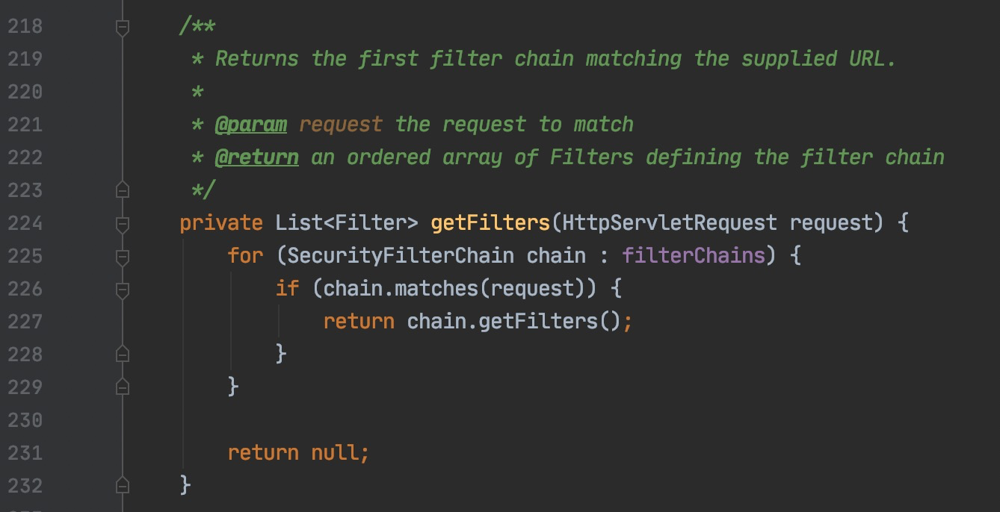

# Spring Security Servlet 实现原理

Spring Security 对 Servlet 的支持是基于 `javax.servlet.Filter` 实现的。

## Javax Servlet - Filters

在 Servlet 应用中，一次 HTTP 请求的分层处理如下图所示：

Client 给应用发送一个 HTTP 请求，Servlet 容器会创建一个包含 `Filter` 和 `Servlet` 的 `FilterChain`，`FilterChain` 会基于请求 URI 中的 path 部分来处理对应的 `HttpServletRequest`。在 Spring MVC 应用中， `Servlet` 具体是 `org.springframework.web.servlet.DispatcherServlet`。

一个 `Servlet` 最多可以处理一次 `HttpServletRequest` 和 `HttpServletResponse`，但是 `Filter` 可以被使用多次，可以用于：

- 防止下游的 `Filter` 或者 `Servlet` 被调用；
- 修改下游的 `Filter` 和 `Servlet` 所使用的 `HttpServletRequest` 或者 `HttpServletResponse`。

## Spring Web MVC - DelegatingFilterProxy

Spring Web MVC 提供了一个名为 `DelegatingFilterProxy` 的 `Filter` 实现类，**用于连接 Servlet 容器和 Spring 的 `ApplicationContext`**。Servlet 容器只允许注册标准的 `Filter` 实现类，不能注册 Spring IoC 容器中定义的 Bean。`DelegatingFilterProxy` 实现了 `Filter` 接口，可以被标准的 Servlet 容器所注册，并且 **可以把 `Filter` 的实现逻辑委托给一个实现了 `Filter` 接口的 Spring Bean**。

`DelegatingFilterProxy` 的工作机制如下图所示：

`DelegatingFilterProxy` 会在 Spring `ApplicationContext` 中查找 Bean Filter0，然后调用 Bean Filter0 中的 `Filter` 实现逻辑。

## Spring Security - FilterChainProxy

Spring Security 提供了一个名为 `FilterChainProxy` 的特殊的 `Filter` 实现类，**可以通过 `SecurityFilterChain` 来委托多个 Filter 的实例**。`FilterChainProxy` 属于 Spring Bean，会被包装在 `DelegatingFilterProxy` 中。

`FilterChainProxy` 的工作机制如下图所示：

## Spring Security - SecurityFilterChain

`FilterChainProxy` 使用 `SecurityFilterChain` 来 **确定在当前的 HTTP 请求中应该调用那些 Spring Security 相关的 `Filter`**。

SecurityFilterChain 的工作机制如下图所示：

`SecurityFilterChain` 中 Spring Security 相关的 `Filter` 都属于 Spring Bean，会被注册到 `FilterChainProxy` 而不是 `DelegatingFilterProxy` 中。选择将 `Filter` 注册到 `FilterChainProxy`，而不是直接注册到 Servlet 容器或者 `DelegatingFilterProxy` 会有许多好处。首先，**`FilterChainProxy` 为 Spring Security 对 Servlet 的所有支持提供了一个起点**。因此，如果开发者在尝试解决应用中 Spring Security 相关问题的时候，可以在 `FilterChainProxy` 中添加一个断点然后开始 debug。

其次，`FilterChainProxy` 对于 Spring Security 的工作机制来说非常重要，它还被设计成 **可以执行一些辅助性质的任务**。例如，`FilterChainProxy` 会清除 `SecurityContext` 中的数据，用于避免内存泄漏；`FilterChainProxy` 还会通过使用 Spring Security 的 `HttpFirewall` 来保护应用免受某些类型的攻击。

另外，`FilterChainProxy` 提供了更大的灵活性，**用于确定应该在何时需要调用 `SecurityFilterChain`**。在 Servlet 容器中，仅会单独根据 URL 是否匹配来确定是否需要调用 `Filter`。然而，通过使用 `RequestMatcher` 接口，`FilterChainProxy` 可以基于 `HttpServletRequest` 中的任何内容来确定是否需要调用 `Filter`。

## 总结

`WebSecurityConfiguration` 创建并配置 `WebSecurity`，`WebSecurity` 用于构建 `FilterChainProxy`。

## 参考资料

- [Spring Security - Servlet Security](https://docs.spring.io/spring-security/site/docs/5.3.2.RELEASE/reference/html5/#servlet-architecture)
