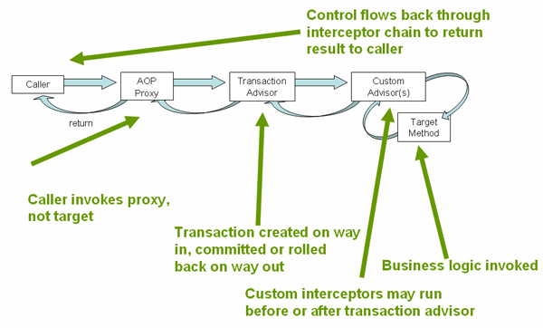

# Spring Transaction 声明式事务管理

## 理解声明式事物的具体实现

Spring Framework 的声明式事务管理是通过 AOP 代理来实现的，并且事务的具体行为（例如传播行为、隔离级别、超时时间、是否只读）是通过一些元数据来配置的（基于 `@Transactional` 或者基于 XML 方式）。

执行事务的 AOP 代理类中会包含配置事务行为的元数据，它会结合使用 `TransactionInterceptor` 和 `TransactionManager` 来驱动事务的执行。

声明式事务的调用流程如下图所示：

## 使用 `@Transactional`

在使用 `@Transactional` 的时候，有些事项需要注意一下：

1. `@Transactional` 负责配置事务行为的元数据，并不负责事务管理的具体实现；
2. 被 `@Transactional` 标记的方法，需要 **保证其访问权限是 public**。因为这个方法需要被 AOP 代理类来调用；
3. Spring 推荐在具体的实现类（而不是接口）上使用 `@Transactional`。因为在接口上标记的 `@Transactional` 仅对于使用 Jdk Dynamic Proxy 实现的 AOP 模式有效，对于使用 Cglib Proxy 实现的 AOP 模式无效；
4. 在 AOP 的 Proxy 模式中，只有 **外部的方法调用才会触发事务**，即在一个类中的内部方法调用是不会触发事务的。

## 事务的传播行为

当在已经存在事务的方法中执行新的事务方法时，就会涉及到事务的传播行为。Spring 在 `Propagation` 枚举类中定义了事务的传播行为，具体字段如下：

| 传播行为                    | 说明                                                                     |
| --------------------------- | ------------------------------------------------------------------------ |
| `Propagation.REQUIRED`      | 支持当前事务；如果当前不存在事务，则创建事务                             |
| `Propagation.SUPPORTS`      | 支持当前事务；如果当前不存在事务，则以非事务方式执行                     |
| `Propagation.MANDATORY`     | 支持当前事务；如果当前不存在事务，则抛出异常                             |
| `Propagation.REQUIRES_NEW`  | 创建新的事务；如果当前存在事务，则挂起当前事务                           |
| `Propagation.NOT_SUPPORTED` | 以非事务方式执行；如果当前存在事务，则挂起当前事务                       |
| `Propagation.NEVER`         | 以非事务方式执行；如果当前存在事务，则抛出异常                           |
| `Propagation.NESTED`        | 以嵌套事务方式执行；如果当前不存在事务，则与 `Propagation.REQUIRED` 类似 |

## 参考资料

- [Transaction Management - Declarative transaction management](https://docs.spring.io/spring/docs/5.2.7.RELEASE/spring-framework-reference/data-access.html#transaction-declarative)
