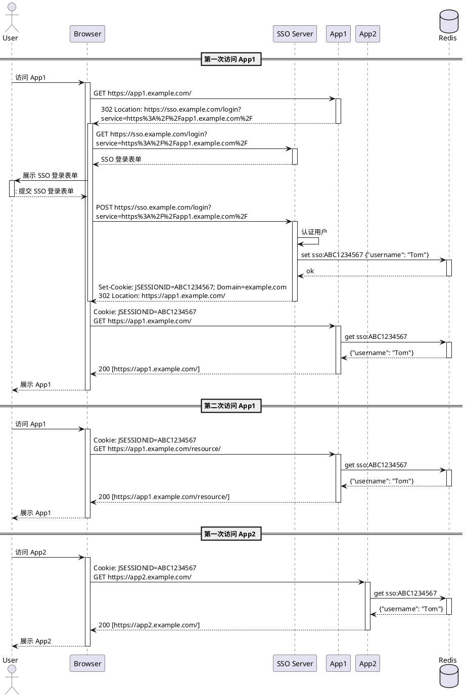
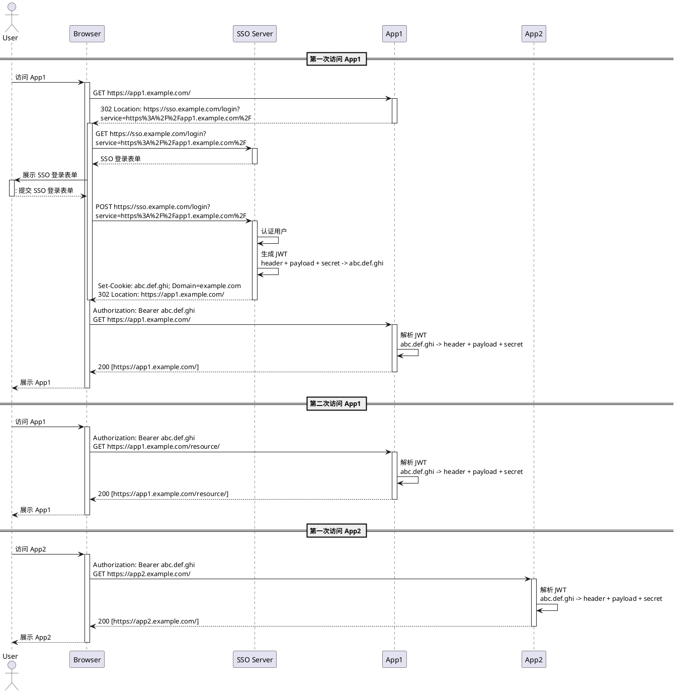
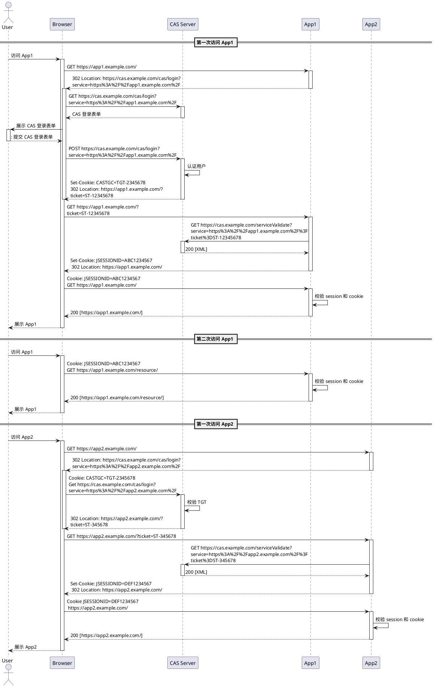

# 单点登录解决方案

## 共享 Session

优点：

1. 实现单点登出比较简单

缺点：

1. 不支持跨顶级域名登录
2. 严重依赖外部系统（Redis）

## JSON Web Token (JWT)

优点：

1. 服务端无状态

缺点：

1. 不支持跨顶级域名登录
2. 实现单点登出（失效 Token）比较复杂
3. 续签 Token 比较复杂
4. 需要额外的计算成本

## Central Authentication Service (CAS)

优点：

1. 支持跨顶级域名登录

缺点

1. 实现单点登出比较复杂
