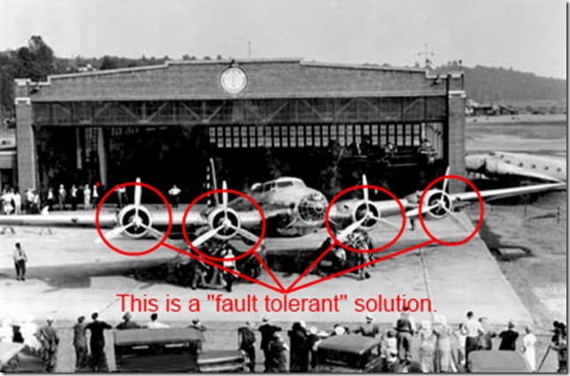
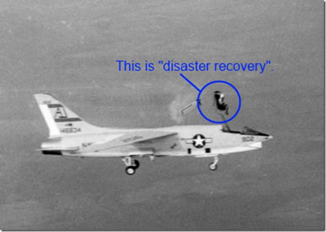

# 容错，高可用和灾备

## 容错

容错（fault tolerance）指的是，**发生故障时，系统还能继续运行**。

飞机有四个引擎，如果一个引擎坏了，剩下三个引擎，还能继续飞，这就是 " 容错 "。同样的，汽车的一个轮子扎破了，剩下三个轮子，也还是勉强能行驶。

容错的目的是，发生故障时，系统的运行水平可能有所下降，但是依然可用，不会完全失败。

## 高可用

高可用（high availability）指的是，**系统能够比正常时间更久地保持一定的运行水平**。

汽车的备胎就是一个高可用的例子。如果没有备胎，轮胎坏了，车就开不久了。备胎延长了汽车行驶的可用时间。

注意，**高可用不是指系统不中断（那是容错能力），而是指一旦中断能够快速恢复**，即中断必须是短暂的。如果需要很长时间才能恢复可用性，就不叫高可用了。上面例子中，更换备胎就必须停车，但只要装上去，就能回到行驶状态。

## 灾备

灾备（又称灾难恢复，disaster recovery）指的是，**发生灾难时恢复业务的能力**。

上图中，飞机是你的 IT 基础设施，飞行员是你的业务，飞行员弹射装置就是灾备措施。一旦飞机即将坠毁，你的基础设施就要没了，灾备可以让你的业务幸存下来。

灾备的目的就是，保存系统的核心部分。一个好的灾备方案，就是从失败的基础设施中获取企业最宝贵的数据，然后在新的基础设施上恢复它们。注意，灾备不是为了挽救基础设置，而是为了挽救业务。

## 参考资料

- [容错，高可用和灾备](https://www.ruanyifeng.com/blog/2019/11/fault-tolerance.html)
