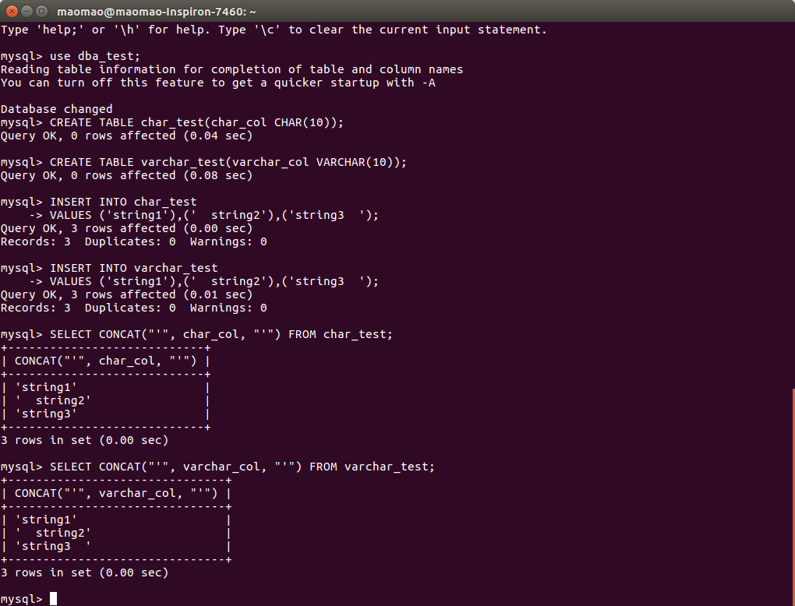
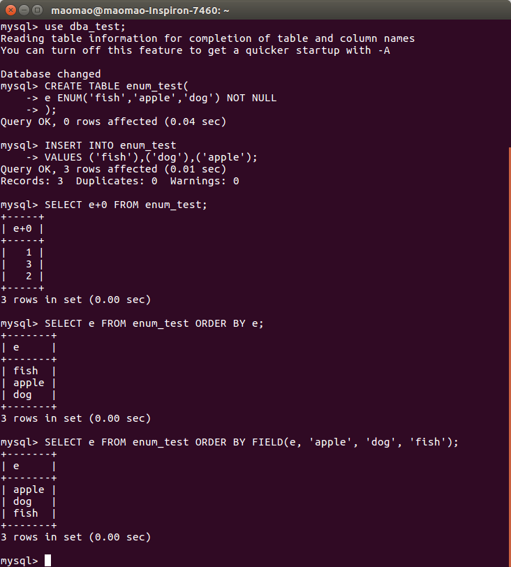
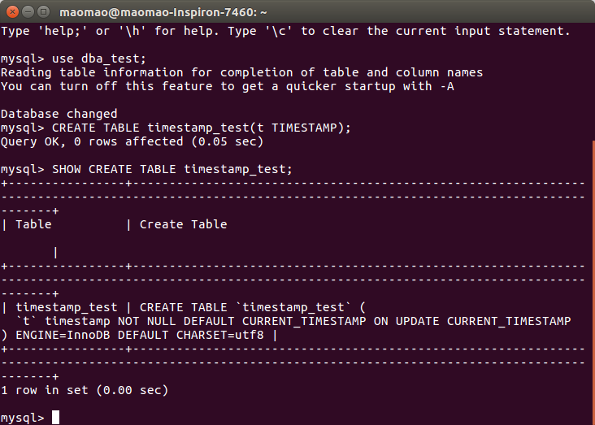
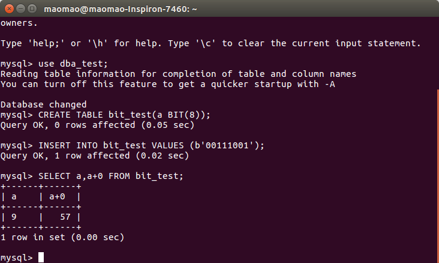

# 《高性能 MySQL》笔记 - Schema 与数据类型优化

良好的逻辑设计和物理设计是高性能的基石，应该根据系统将要执行的查询语句来设计 schema，这往往需要权衡各种因素。例如，反范式的设计可以加快某些类型的查询，但同时可能使另一些类型的查询变慢。比如添加计数表和汇总表是一种很好的优化查询的方式，但这些表的维护成本可能会很高。MySQL 独有的特性和实现细节对性能的影响也很大。

## 选择优化的数据类型

MySQL 支持的数据类型非常多，选择正确的数据类型对于获取高性能至关重要。不管存储哪种类型的数据，都应遵从下面几个原则：

1. **更小的通常更好**

    一般情况下，应该尽量使用可以正确存储数据的最小数据类型。更小的数据类型通常更快，因为它们占用更少的磁盘、内存和 CPU 缓存，并且处理时需要的 CPU 周期也更少。

2. **简单就好**

    简单数据类型的操作通常需要更少的 CPU 周期。例如整型比字符串代价更低，因为字符集和校对规则使字符串比较比整型比较更复杂。建议使用 MySQL 内建的类型而不是字符串来存储日期时间，建议使用整型存储 IP 地址。

3. **尽量避免 NULL**

    通常情况下最好指定列为 NOT NULL，除非真的需要存储 NULL 值。如果查询中包含可为 NULL 的列，对 MySQL 来说更难优化，因为可为 NULL 的列使得索引、索引统计和值比较都更复杂。可能为 NULL 的列会使用更多的存储空间，在 MySQL 里也需要特殊处理。当可为 NULL 的列被索引时，每个索引记录需要一个额外的字节，在 MyISAM 里甚至还可能导致固定大小的索引（例如只有一个整数列的索引）变成可变大小的索引。

在为列选择数据类型时，第一步确定合适的大类型：数字、字符串、时间等，第二步选择具体类型。很多 MySQL 的数据类型可以存储相同类型的数据，只是存储的长度和范围不一样、允许的精度不同、需要的物理空间（磁盘和内存空间）不同。相同大类型的不同子类型数据有时也有一些特殊的行为和属性，如 `DATETIME` 和 `TIMESTAMP`。

## 整数类型

可以使用这几种整型类型：`TINYINT`、`SMALLINT`、`MEDIUMINT`、`INT`、`BIGINT`，分别使用 8、16、24、32、64 位存储空间，它们的存储的值的范围从 `-2 ^ (N - 1)` 到 `2 ^ (N - 1) - 1`，其中 N 是存储空间的位数。

整数类型有可选的 `UNSIGNED` 属性，表示不允许负值，这大致可以使正数的上限提高一倍。例如 `TINYINT UNSIGNED` 可以存储的范围是 0 ~ 255，而 `TINYINT` 的存储范围是 -128 ~ 127。

整数计算一般使用 64 为的 `BIGINT` 整数，即使在 32 位环境也是如此。（一些聚合函数是例外，它们使用 `DECIMAL` 或 `DOUBLE` 进行计算）

MySQL 可以为整数类型指定宽度，例如 `INT(11)`，对大多数应用这是没有意义的：它不会限制值的合法范围，只是规定类 MySQL 的一些交互工具用来显示字符的个数。对于存储和计算来说，`INT(1)` 和 `INT(20)` 是相同的。

## 实数类型

实数是带有小数部分的数字。它们不只是为了存储小数部分，也可以使用 `DECIMAL` 存储比 `BIGINT` 还大的整数。MySQL 既支持精确类型，也支持不精确类型。

`FLOAT` 和 `DOUBLE` 类型支持使用标准的浮点运算进行近似计算。`DECIMAL` 类型用于存储精确的小数。因为 CPU 不支持 `DECIMAL` 的直接计算，所以在 MySQL 5.0 及更高版本中，MySQL 服务器自身实现了 `DECIMAL` 的高精度计算。

浮点和 `DECIMAL` 类型都可以指定精度。对于 `DECIMAL` 列，可以指定小数点前后所允许的最大位数，这会影响列的空间消耗。有多种方法可以指定浮点列所需要的精度，这会使得 MySQL 悄悄选择不同的数据类型，或者在存储时对值进行取舍。这些精度定义是非标准的，所以一般建议只指定数据类型，不指定精度。

浮点类型在存储相同范围的值时，通常比 `DECIMAL` 使用更少的空间。`FLOAT` 使用 4 个字节存储，`DOUBLE` 使用 8 个字节，相比 `FLOAT` 有更高的精度和更大的范围。和整数类型一样，能选择的只是存储类型。MySQL 使用 `DOUBLE` 作为内部浮点计算的类型。

因为需要额外的空间和计算开销，所以应该尽量只在对小数进行精确计算时才使用 `DECIMAL`，例如财务数据。但在数据量比较大的时候，可以考虑使用 `BIGINT` 代替 `DECIMAL`，将需要存储的货币单位根据小数的位数乘以相应的倍数即可。

## 字符串类型

MySQL 支持多种字符串类型，每种类型还有很多变种。这些数据类型在 4.1 和 5.0 版本发生了很大的变化，使得情况更加复杂。从 MySQL 4.1 开始，每个字符串列可以定义自己的字符集和排序规则，或者说校对规则。这些东西会很大程度上影响性能。

### VARCHAR 和 CHAR 类型

`VARCHAR` 和 `CHAR` 是两种主要的字符串类型，这两种类型的值是在磁盘和内存中的存储方式，与存储引擎的具体实现有关。下面的描述假设使用的存储引擎是 InnoDB 或 MyISAM，如果使用的不是这两种存储引擎，请参考所使用的存储引擎的文档。

- `VARCHAR` 类型用于存储可变长的字符串，是最常见的字符串数据类型。它比定长类型更节省空间，因为它仅使用必要的空间；
- `VARCHAR` 需要使用 1 或 2 个额外字节记录字符串长度：如果列的最大长度小于或等于 255 字节，则只使用 1 个字节表示，否则使用 2 个字节；
- `VARCHAR` 节省了存储空间，所以对性能也有帮助。但由于行是变长的，在 UPDATE 时可能使行变得比原来更长，这就导致 MySQL 需要做额外的工作；
- `VARCHAR` 适用于以下场景：字符串列的最大长度比平均长度大很多；列的更新很少，所以碎片不是问题；使用了像 UTF-8 这样复杂的字符集，每个字符都使用不同的字节数进行存储；
- 在 5.0 及更高版本，MySQL 在存储和检索时，会保留末尾空格。在 4.1 或更老版本，MySQL 会剔除末尾空格；
- InnoDB 会灵活地把过长的 `VARCHAR` 存储为 `BLOB`。
 
- `CHAR` 类型是定长的，MySQL 总是根据定义的字符串长度分配足够的空间；
- `CHAR` 在存储值时，MySQL 会删除所有的末尾空格；
- `CHAR` 适合存储很短的字符串，或者所有值都接近同一个长度，例如存储密码的 MD5 值；
- 对于经常变更的数据，`CHAR` 比 `VARCHAR` 更不容易产生碎片；
- 对于非常短的列，`CHAR` 比 `VARCHAR` 在存储空间上更有效率。

类型的这些行为可能有一点难以理解，下面通过一个具体的例子来说明：

与 `CHAR` 和 `VARCHAR` 类似的类型还有 `BINARY` 和 `VARBINARY`，它们存储的是二进制字符串。二进制字符串跟常规字符串非常相似，但是二进制字符串存储的是字节码而不是字符串，填充也不一样：MySQL 填充 `BINARY` 采用 `\0` 而不是空格，在检索时也不会去掉填充值。

记住一点，慷慨是不明智的。使用 `VARCHAR(5)` 和 `VARCHAR(200)` 存储 `hello` 的空间开销是一样的，但是更长的列会消耗更多的内存，因为 MySQL 通常会分配固定大小的内存块来保存内部值。

### BLOB 和 TEXT 类型

`BLOB` 和 `TEXT` 都是为存储很大的数据而设计的字符串数据类型，分别采用二进制和字符方式存储。

实际上，它们分别属于两组不同的数据类型家族：字符类型是 `TINYTEXT`、`SMALLTEXT`、`TEXT`、`MEDIUMTEXT`、`LONGTEXT`；二进制类型是 `TINYBLOB`、`SMALLBLOB`、`BLOB`、`MEDIUMBLOB`、`LONGBLOB`。`TEXT` 是 `SMALLTEXT` 的同义词，`BLOB` 是 `SMALLBLOB` 的同义词。

与其它类型不同，MySQL 把每个 `BLOB` 和 `TEXT` 值当作一个独立的对象处理。存储引擎在存储时通常会特殊处理。当 `BLOB` 和 `TEXT` 值太大时，InnoDB 会使用专门的「外部」存储区域来进行存储，此时每个值在行内需要 1 ~ 4 个字节存储一个指针，然后在外部区域存储实际值。

`BLOB` 和 `TEXT` 家族之间仅有的不同是 `BLOB` 类型存储的是二进制数据，没有排序规则或字符集，而 `TEXT` 类型有字符集和排序规则。

MySQL 对 `BLOB` 和 `TEXT` 列进行排序与其他类型是不同的：它只对每个列的最前 max_sort_length 字节而不是整个字符串做排序。如果只需要排序前面的一小部分字符，则可以减小 max_sort_length 的配置，或者使用 `ORDER BY SUBSTRING(column, length)`。

MySQL 不能将 `BLOB` 和 `TEXT` 列全部长度的字符串进行索引，也不能使用这些索引消除排序。

### 使用枚举代替字符串类型

枚举（ENUM）列可以把一些不重复的字符串存储成一个预定义的集合。MySQL 在存储枚举时非常紧凑，会根据列表值的数量压缩到一个或者两个字节中。MySQL 在内部会将每个值在列表中的位置保存为整数，并且在表的 .frm 文件中保存 「数组 - 字符串」 映射关系的查找表。

枚举字段是按照内部存储的整数而不是定义的字符串进行排序的。一种绕过这种限制的方式是按照需要的顺序来定义枚举列。另外也可以在查询中使用 `FIELD()` 函数显式地指定排序顺序，但这会导致 MySQL 无法利用索引消除排序。下面有一个例子：

枚举最不好的地方是，字符串列表是固定的，添加或删除字符串必须使用 `ALTER TABLE`。因此，对于一系列未来可能会改变的字符串，使用枚举不是一个好主意。

由于 MySQL 把每个枚举值保存为整数，并且必须进行查找才能转换为字符串，所以枚举列有一些开销。通常枚举的列表都比较小，所以开销还可以控制，但也不能保证一直如此。在特定情况下，把 `CHAR` / `VARCHAR` 列与枚举列进行关联可能会比直接关联 `CHAR` / `VARCHAR` 列更慢。

## 日期和时间类型

MySQL 可以使用许多类型来保存日期和时间值，例如 `YEAR` 和 `DATE`。MySQL 能存储的最小时间粒度为秒（MariaDB 支持微秒级别的时间类型），但是 MySQL 也可以使用微秒级的粒度进行临时运算，例如使用 `BIGINT` 类型存储微秒级别的时间戳，或使用 `DOUBLE` 存储秒之后的小数部分。

- `DATETIME` 类型能保存大范围的值，从 1001 年到 9999 年，精度为秒。它把日期和时间封装到格式为 YYYYMMDDHHMMSS 的整数中，与时区无关，使用 8 个字节的存储空间；
- 默认情况下，MySQL 以一种可排序的、无歧义的格式显示 `DATETIME` 值，例如 「2008-01-16 22:37:08」。这是 ANSI 标准定义的日期和时间表示法。
 
- `TIMESTAMP` 类型保存了从 1970 年 1 月 1 日午夜（格林尼治标准时间）以来的秒数，它和 Unix 时间戳相同。`TIMESTAMP` 只使用 4 个字符的存储空间，因此它的范围比 `DATETIME` 小得多：只能表示从 1970 年到 2038 年；
- MySQL 提供了 `FROM_UNIXTIME()` 函数把 Unix 时间戳转换为日期，并提供了 `UNIX_TIMESTAMP()` 函数把日期转换为 Unix 时间戳；
- MySQL 4.1 及更新的版本按照 `DATETIME` 的方式格式化 `TIMESTAMP` 的值。这仅仅是显示格式上的区别，`TIMESTAMP` 的存储格式在各个版本都是一样的；
- `TIMESTAMP` 显示的值依赖于时区。MySQL 服务器、操作系统、以及客户端连接都有时区设置。因此，存储值为 0 的 `TIMESTAMP` 在美国东部时区显示为「1969-12-31 19:00:00」，与格林尼治时间差 5 个小时；
- 默认情况下，如果在插入记录时没有指定第一个 `TIMESTAMP` 列的值，MySQL 则设置这个列的值为当前时间。在更新记录时，MySQL 默认也会更新第一个 `TIMESTAMP` 列的值（除非在 UPDATE 语句中明确指定了值）；
- `TIMESTAMP` 列默认为 NOT NULL，这也和其它的数据类型不一样。

下面有一个例子：

除了特殊行为之外，通常应该使用 `TIMESTAMP`，因为它比 `DATETIME` 空间效率更高。有时人们也会将 Unix 时间戳存储为整数值，但这不会带来任何收益。用整数保存时间戳的格式通常步方便处理。

## 位数据类型

MySQL 有少数几种存储类型使用紧凑的位存储数据。所有这些位类型，不管底层存储格式和处理方式如何，从技术上来说都是字符串类型。

### BIT

在 MySQL 5.0 之前，`BIT` 是 `TINYINT` 的同义词。但是在 MySQL 5.0 以及更新版本，这是一个特性完全不同的数据类型。

可以使用 `BIT` 列在一列中存储一个或多个 true / false 值。`BIT(1)` 定义一个包含单个位的字段，`BIT(2)` 存储 2 个位，以此类推。`BIT` 列的最大长度是 64 位。

`BIT` 的行为因存储引擎而异。MyISAM 会打包存储的所有 `BIT` 列，其它存储引擎如 Memory 和 InnoDB，为每个 `BIT` 列使用一个足够存储的最小整数类型来存放。

MySQL 把 `BIT` 当作字符串类型，而不是数字类型。当检索 `BIT(1)` 的值时，结果是一个包含二进制 0 或 1 值的字符串，而不是 ASCII 码的 0 或 1。然而，在数据上下文的场景中检索时，结果是将位字符串转换成数字。如下例所示：

这是相当令人费解的，所以一般建议应该谨慎使用 `BIT` 类型。对于大部分应用，最好避免使用 `BIT` 类型。如果想在一个 bit 的存储空间中存储一个 true / false 值，另一个方法是创建一个可以为空的 `CHAR(0)` 列。该列可以保存空值（NULL）或者长度为零的字符串（空字符串）。

### SET

如果需要保存很多 true / false 值，可以考虑合并这些列到一个 `SET` 数据类型，它在 MySQL 内部是以一系列打包的位的集合来表示的。这样就有效地利用了存储空间，并且 MySQL 有像 `FING_IN_SET()` 和 `FIELD()` 这样的函数，方便在查询中使用。

`SET` 类型的主要缺点是改变列的定义代价比较高，需要 `ALTER TABLE`，这对大表来说是非常昂贵的操作。一般来说，也无法在 `SET` 列上通过索引查找。

### 在整数列上进行按位操作

一种替代 SET 的方式是使用一个整数包装一系列的位。例如，可以把 8 个位包装到一个 `TINYINT` 中，并且按位操作来使用。

比起 `SET`，这种办法的好处在于可以不使用 `ALTER TABLE` 改变字段代表的 「枚举」 值，缺点是查询语句更难写，并且更难理解。

## 选择标识符

为标识符（identifier column）选择合适的数据类型非常重要。一般来说更有可能用标识符列与其它列进行比较（例如在关联操作中），或者通过标识符列寻找其它列。标识符列也可能在另外的表中作为外键使用，所以为标识符列选择数据类型时，应该选择跟关联表中的对应列一样的类型。

当选择标识列的类型时，不仅仅需要考虑存储类型，还需要考虑 MySQL 对这种类型怎么执行计算和比较。例如，MySQL 在内部使用整数存储 `ENUM` 和 `SET` 类型，然后在做比较操作时转换为字符串。

一旦选定了一种类型，要确保在所有关联表中都使用相同的类型，类型之间需要精确匹配，包括像 `UNSIGNED` 这样的属性。混用不同数据类型可能导致性能问题，即使没有性能影响，在比较操作时隐式类型转换也可能导致很难发现的错误。

在可以满足值的范围要求，并且预留未来增长空间的前提下，应该选择最小的数据类型。例如有一个 state_id 列存储美国各州的名字，就不需要几千或几百万个值，所以不需要使用 `INT`。`TINYINT` 足够存储，而且比 `INT` 少了 3 个字节。如果用这个值作为其它表的外键，3 个字节可能导致很大的性能差异。

### 整数类型

整数通常是标识列最好的选择，因为他们很快并且可以使用 AUTO_INCREMENT。

### ENUM 和 SET 类型

对于标识符列来说，`ENUM` 和 `SET` 类型通常是一个糟糕的选择，尽管对某些只包含固定状态或者类型的静态「定义表」来说可能是没有问题。`ENUM` 和 `SET` 列适合存储固定信息，例如有序的状态、产品类型、人的性别。

### 字符串类型

如果可能，应该避免使用字符串类型作为标识列，因为它们很消耗空间，并且通常比数字类型慢。对于完全 「随机」 的字符串也需要多加注意，例如 `MD5()`、`SHA1()`、`UUID()` 产生的字符串，这些函数生成的新值会任意分布在很大的空间，这会导致 INSERT 以及一些 SELECT 语句变慢：

- 因为插入值会随机地写到索引的不同位置，所以使得 INSERT 语句更慢。这会导致页分裂、磁盘随机访问，以及对于聚簇存储引擎产生聚簇索引碎片；
- SELECT 语句会变得更慢，因为逻辑上相邻的行会分布在磁盘和内存的不同地方；
- 随机值导致缓存对所有类型的查询语句效果都很差，因为会使得缓存赖以工作的访问局部性原理失效。如果整个数据集都一样的「热」，那么缓存任何一部分特定数据到内存都没有好处；如果工作集比内存大，缓存将会有很多刷新和不命中。

如果存储 UUID 值，则应该移除「-」符号，或者更好的做法是使用 `UNHEX()` 函数转换 UUID 值为 16 字节的数字，并且存储在一个 `BINARY(16)` 列中。检索时可以通过 `HEX()` 函数来格式化为十六进制格式。`UUID()` 生成的值与加密散列函数例如 `SHA1()` 生成的值有不同的特征：UUID 值虽然分布也不均匀，但还是有一定顺序的。尽管如此，但还是不如递增的整数好用。

### 特殊类型数据

某些类型的数据并不直接与内置类型一致。低于秒级精度的时间戳就是一个例子，在 [日期和时间类型](#日期和时间类型) 部分演示过存储此类数据的一些选项。

另一个例子是 IPv4 地址。人们经常使用 `VARCHAR(15)` 列来存储 IP 地址。然而它们实际上是 32 位无符号整数，不是字符串。用小数点将地址分成四段的表示方法只是为了让人们阅读容易。所以应该用无符号整数存储 IP 地址。MySQL 提供 `INET_ATON()` 和 `INET_NTOA()` 函数在这两种表示方法之间切换。

## 总结

良好的 schema 设计原则是普遍适用的，但 MySQL 有它自己的实现细节要注意。概括来说，尽可能保持任何东西小而简单总是好的。MySQL 喜欢简单，需要使用数据库的人应该也同样会喜欢简单的原则：

- 尽量避免过度设计，例如会导致极其复杂查询的 schema 设计，或者有很多列的表设计；
- 使用小而简单的合适数据类型，除非真实数据模型中有确切的需要，否的应该尽可能地避免使用 NULL 值；
- 尽量使用相同的数据类型存储相似或相关的值，尤其是要在关联条件中使用的列；
- 注意可变长字符串，其在临时表和排序时可能导致悲观的按最大长度分配内存；
- 尽量使用整型定义标识列；
- 避免使用 MySQL 已经遗弃的特性，例如指定浮点数的精度，或者整型的显示宽度；
- 小心使用 `ENUM` 和 `SET`，最好避免使用 `BIT`。

范式是好的，但是反范式有时也是必需的，并且能带来好处。预先或生成汇总表也可能获得很大的好处。

最后，`ALTER TABLE` 是让人痛苦的操作，因为在大部分情况下，它都会锁表并且重建整张表。
