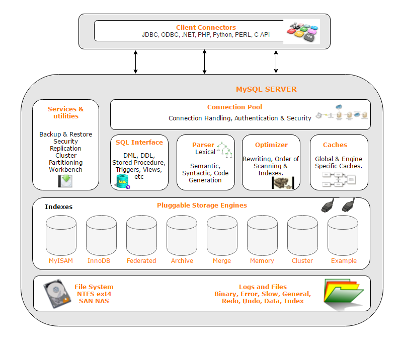

# 《高性能 MySQL》笔记 - 创建高性能的索引

## 索引基础

索引（在 MySQL 中也叫做键 key）是存储引擎用于快速找到记录的一种数据结构。索引对于良好的性能非常关键，尤其是当表中的数据量越来越大时，索引对性能的影响愈发重要。在数据量较小且负载比较低时，不恰当的索引对性能的影响可能还不明显，但当数据量逐渐增大时，性能则会急剧下降。

理解 MySQL 中索引是如何工作的，最简单的方法就是去看看一本书的「索引」部分。如果想在一本书中找到某个特定主题，一般会先看书的「索引」，再找到对应的页码。在 MySQL 中，存储引擎用类似的方法使用索引，其先在索引中找到对应值，然后根据匹配的索引记录找到对应的数据行。

索引优化应该是对查询性能优化最有效的手段了。索引能够轻易将查询性能提高几个数量级，「最优」的索引有时比「好的」索引性能要好两个数量级。

索引可以包含一个或多个列的值。如果索引包含多个列，那么列的顺序也十分重要，因为 MySQL 只能高效地使用索引的最左前缀列。创建一个包含两个列的索引，和创建两个只包含一个列的索引是大不相同的。

## 索引的类型

索引有很多种类型，可以为不同的场景提供更好的性能。在 MySQL 中，索引是在存储引擎层而不是服务器层实现的。所以，并没有统一的索引标准，不同存储引擎的索引的工作方式并不一样，也不是所有的存储引擎都支持所有类型的索引，即使多个存储引擎支持同一种类型的索引，其底层实现也可能不同。

MySQL 逻辑架构可以参考下图：



### B-Tree 索引

当人们谈论索引的时候，如果没有特别指明类型，多半说的是 [B-Tree](https://en.wikipedia.org/wiki/B-tree) 索引，它使用 B-Tree 数据结构来存储数据。底层的存储引擎也可能使用不同的存储结构，例如 NDB 群集存储引擎内部实际上使用了 [T-Tree](https://en.wikipedia.org/wiki/T-tree) 结构存储索引，InnoDB 则使用的是 [B+Tree](https://en.wikipedia.org/wiki/B%2B_tree) 数据结构。

存储引擎以不同的方式使用 B-Tree 索引，性能也各有不同、各有优劣。例如 MyISAM 使用前缀压缩技术使得索引更小，但 InnoDB 则按照原数据格式进行存储。再如 MyISAM 索引通过数据的物理位置引用被索引的行，而 InnoDB 则根据主键引用被索引的行。

B-Tree 数据结构和算法原理可以参考文章 [《MySQL 索引背后的数据结构及算法原理》](http://blog.codinglabs.org/articles/theory-of-mysql-index.html)。

B-Tree 通常意味着所有的值都是按顺序存储的，并且每一个叶子节点到根节点的距离相同。叶子节点比较特别，它们的指针指向的是被索引的数据，而不是其它的节点。树的深度和表的大小直接相关。

B-Tree 索引能加快访问数据的速度，因为存储引擎不再需要进行全表扫描来获取需要的数据，取而代之的是从索引的根节点开始进行搜索。根节点的槽中存放了指向子节点的指针，存储引擎根据这些指针向下层查找。通过比较节点中的值和需要查找的值，找到合适的指针进入下层子节点。这些指针实际上定义了子节点中值的上限和下限。最终存储引擎要么是找到对应的值，要么是得出该值的记录不存在。

B-Tree 对索引列是顺序组织存储的，所以很适合查找范围数据。例如，在一个基于文本域的索引树上，按字母顺序连续传递的值进行查找是非常合适的。索引对多个值进行排序的依据是 `CREATE TABLE` 语句中定义索引时列的顺序。

假设有如下数据表：

```sql
CREATE TABLE People (
  last_name  VARCHAR(50)     NOT NULL,
  first_name VARCHAR(50)     NOT NULL,
  dob        DATE            NOT NULL,
  gender     ENUM ('m', 'f') NOT NULL,
  KEY (last_name, first_name, dob)
)
```

B-Tree 索引适用于全键值、键值范围或键前缀查找。其中键前缀查找只适用于根据最左前缀的查找前面所述的索引对如下类型的查询有效：

- **全值匹配**：全值匹配指的是和索引中的所有列进行匹配，如 `... WHERE last_name = 'Allen' AND first_name = 'Cuba' AND dob = '1960-01-01'`；
- **匹配最左前缀**：只使用索引的第一列，如 `... WHERE last_name = 'Allen'`；
- **匹配列前缀**：匹配索引第一列值的开头部分，如 `... WHERE last_name LIKE 'A%'`；
- **匹配范围值**：范围匹配索引第一列值，如 `... WHERE last_name BETWEEN 'Allen' AND 'Barry'`；
- **精确匹配某一列并范围匹配另一列**：精确匹配索引第一列值，并范围匹配第二列值，如 `... WHERE last_name = 'Allen' AND first_name LIKE 'C%'`；
- **只访问索引的查询**：只访问索引数据，如 `SELECT last_name, first_name FROM People WHERE last_name = 'Allen'`。这种情况叫做 [覆盖索引](#覆盖索引)，即只须访问索引，而无须访问数据行。

**因为索引树中的节点是有序的，所以除了按值查找之外，索引还可以用于 ORDER BY 操作**。一般来说，如果 B-Tree 可以按照某种方式查找到值，那么也可以按照这种方式用于排序。所以如果 ORDER BY 子句满足前面列出的几种查询类型，则这个索引也可以满足对应的排序需求。

以下是一些关于 B-Tree 索引的限制：

- 如果不是按照索引的最左列开始查找，则无法使用索引，如 `... WHERE first_name = 'Cuba'`；
- 不能跳过索引中的列，如 `... WHERE last_name = 'Allen' AND dob = '1960-01-01'`；
- 如果查询中有某个列的范围查询，则其右边所有列都无法使用索引优化查询，如 `... WHERE last_name = 'Allen' AND first_name = 'C%' AND dob = '1960-01-01'`，此时只能使用前两列索引。

索引列的顺序至关重要，这些限制都和索引列的顺序有关。在优化性能的时候，可能需要使用相同的列但顺序不同的索引来满足不同类型的查询需求。

### 哈希索引

哈希索引基于哈希表实现，只有精确匹配索引所有列的查询才有效。对于每一行数据，存储引擎都会对所有的索引列计算一个哈希码。哈希索引将所有的哈希码存储在索引中，同时在哈希表中保存指向行数据的指针。在 MySQL 中，只有 Memory 引擎显式支持哈希索引。因为索引自身只需存储对应的哈希值，所以索引的结构十分紧凑，这也让哈希索引查找的速度非常快。然而哈希索引也有它的限制：

- 哈希索引只包含哈希值和行指针，而不存储字段，所以不能使用 [覆盖索引](#覆盖索引)；
- 哈希索引并不是按照索引值顺序存储的，所以也就无法用于排序；
- 哈希索引也不支持部分索引列匹配查找，因为哈希索引始终是使用索引列的全部内容来计算哈希值的；
- 哈希索引只支持等值比较，包括 =、IN()、<=>；
- 访问哈希索引的数据非常快，除非有很多哈希冲突。如果哈希冲突很多的话，一些索引维护操作的代价也会很高。

InnoDB 引擎有一个特殊的功能叫做「自适应哈希索引」。当 InnoDB 注意到某些索引值被使用得非常频繁时，它会在内存中基于 B-Tree 索引之上再创建一个哈希索引。

### 空间数据索引（R-Tree）

MyISAM 存储引擎支持空间索引。和 B-Tree 索引不同，空间索引无须前缀查询。空间索引会从所有维度来索引数据。查询时，可以有效地使用任意维度来组合查询。必须使用 MySQL 的 GIS 相关函数如 `MBRCONTATNS()` 等来维护数据。MySQL 的 GIS 支持并不完善，所以大部分人都不会使用这个特性。

### 全文索引

全文索引是一种特殊类型的索引，它查找的是文本中的关键字，而不是直接比较索引中的值。它有许多需要注意的细节，如停用词、词干和复数、布尔搜索等。全文索引更类似于搜索引擎做的事情，适用于 `MATCH AGAINST` 操作，而不是普通的 `WHERE` 条件操作。

在相同的列上同时创建全文索引和基于 B-Tree 索引不会有冲突。

### 其它索引类别

还有很多第三方的存储引擎使用不同类型的数据结构来存储索引。

## 索引的优点

索引可以让服务器快速地定位到表的指定位置，但这不是索引的唯一作用，根据创建索引的数据结构不同，索引也有一些其它的附加作用。最常见的 B-Tree 索引按照顺序存储数据，所以 MySQL 可以用它来做 `ORDER BY` 和 `GROUP BY` 操作，并且 B-Tree 索引中存储了实际的数据值，所以某些查询只需使用索引就能够完成。总结下来索引有如下三个优点：

1. 大大减少了服务器需要扫描的数据量；
2. 可以帮助服务器避免排序和临时表；
3. 可以将随机 IO 变为顺序 IO。

[《Relational Database Index Design and the Optimizers》](https://book.douban.com/subject/26419771) 书中介绍了如何评定一个索引是否适合某个查询的「三星系统」：

- 一星：使用索引将相关的数据记录放到一起；
- 二星：使用索引将相关的数据顺序与查询的排序顺序保持一致；
- 三星：索引存储的数据包含了查询的所有结果。

索引并不总是最好的工具。对于非常小的表，大部分情况下简单的全表扫描更高效。对于中到大型的表，索引就非常有效。但对特大型的表，建立和使用索引的代价将随之增长，这种情况下，可以使用「分区技术」直接区分出一组查询所需的数据，从而避免一条条地匹配。

## 高性能的索引策略

### 独立的列

MySQL 无法对非「独立的列」使用索引，「独立的列」指索引不能是表达式的一部分，也不能是函数的参数。例如以下的两个查询无法使用索引：

```sql
SELECT actor_id FROM sakila.actor WHERE actor_id + 1 = 5;

SELECT ... WHERE TO_DAYS(CURRENT_DATE) - TO_DAYS(date_col) <= 10;
```

我们应该养成简化 WHERE 条件的习惯，始终将索引列单独放在比较符号的一侧。

### 前缀索引和索引选择性

为了避免索引很长的字符串，导致索引变得大且慢的问题，可以使用「前缀索引」。「前缀索引」可以仅索引字符串的起始部分，以此节约索引空间，从而提高索引效率。

不过前缀索引会降低「索引的选择性」，「索引的选择性」指不重复的索引值（基数）和数据表的记录总数（#T）的比值，范围在 1/#T 到 1 之间。索引的选择性越高则查询效率越高，因为选择性高的索引可以让 MySQL 在查找时过滤更多的行。对于 `BLOB`、`TEXT` 或者很长的 `VARCHAR` 类型的列，MySQL 要求必须使用索引。

设计一个好的前缀索引，诀窍在于要选择足够长的前缀以保证较高的选择性，但同时也不能太长。也就是说，就是要使得索引的前缀基数，尽可能地接近完整列的基数。

前缀索引是一种能使索引更小，更快的有效办法，但也有其缺点：MySQL 无法使用前缀索引做 `ORDER BY` 和 `GROUP BY`，也无法使用前缀索引做覆盖扫描。下面演示一下前缀索引的语法：

```sql
ALTER TABLE db_demo ADD KEY (foo(7));
```

### 多列索引

在多个列上建立独立的单列索引大部分情况下并不能提高 MySQL 的查询性能。例如，表 film_actor 在字段 film_id 和 actor_id 上各有一个单列索引。但对于下面这个查询 WHERE 条件，这两个单列索引都不是好的选择：

```sql
SELECT film_id, actor_id FROM film_actor
WHERE actor_id = 1 OR file_id = 1;
```

旧版本的 MySQL 会对这个查询使用全表扫面，除非改写成如下的两个查询 UNION 的方式：

```sql
SELECT film_id, actor_id FROM film_actor
WHERE actor_id = 1
UNION ALL
SELECT film_id, actor_id FROM film_actor
WHERE film_id = 1 AND actor_id <> 1;
```

5.0+ 版本的 MySQL 引入了一种叫「索引合并」的策略，一定程度上可以使用表的多个单列索引来定位指定的行。这种算法有三个变种：OR 条件的联合（union），AND 条件的相交（intersection），组合前两种情况的联合及相交。

通过 EXPLAIN 中的 Extra 列中可以看到 MySQL 使用「索引合并」技术优化复杂的查询，这种策略有时候是一种优化的结果，但更多时候说明了表上的索引建得很糟糕：

- 当出现服务器对多个索引做相交操作时（有多个 AND 条件），通常意味着需要一个包含所有相关列的多列索引，而不是多个独立的单列索引；
- 当服务器需要对多个索引做联合操作时（有多个 OR 条件），通常需要耗费大量 CPU 和内存资源在算法的缓存、排序和合并操作上。

### 选择合适的索引列顺序

索引列的正确顺序依赖于使用该索引的查询语句，并且需要同时考虑如何更好地满足排序和分组操作。在一个多列的 B-Tree 索引中，索引列的顺序意味着索引首先按照最左列进行排序，之后是第二列，第三列等。因此索引可以按照升序或降序进行扫描，以精确满足符合查询列顺序的 `ORDER BY`、`GROUP BY` 和 `DISTINCT` 等子句的查询需求。

**当不需要考虑排序和分组时，将选择性最高的列放在前面通常是很好的**。此时索引可以作用于优化 WHERE 条件查询，从而更高效地过滤数据。然而，查询的性能并不仅是依赖于索引列的选择性（整体基数），也和查询的具体值有关（值的分布）。下面举一个列子：

```sql
SELECT * FROM payment WHERE staff_id = 2 AND customer_id = 584;
```

对于这个查询语句，该如何选择索引列的顺序呢？可以先执行一些查询，来确定查询中特定的条件值在这个表中的分布情况：

```sql
SELECT SUM(staff_id = 2), SUM(costomer_id = 584) FROM payment\G
************************* 1. row *************************
     SUM(staff_id = 2): 7992
SUM(customer_id = 584): 30;
```

针对此结果，按以往的经验法则，应该将 customer_id 列放在前面，因为其条件值对应的数量更少，MySQL 可以依此过滤更多的行。这之后，我们再来看看 customer_id 条件值对应 staff_id 条件值的选择性：

```sql
SELECT SUM(staff_id = 2) FROM payment WHERE customer_id = 584\G
************************* 1. row *************************
SUM(staff_id = 2): 17
```

从以上结果得出，在 `customer_id = 584` 条件值下，`staff_id = 2` 条件值的选择性更高。但需要注意的是，这种查询结果非常依赖于某一具体的条件值。如果以这种方式优化，针对某些特定场景（如提取关键数据、查询 guest 用户）会很有效，但对于大多数业务场景，则会导致其它条件值的查询变慢，从而拖垮了服务器的整体性能。因此在选择索引列的顺序时，我们应该考虑列的整体基数和选择性，而不是仅依赖于某个查询条件的具体值：

```sql
SELECT
COUNT(DISTINCT staff_id) / COUNT(*) AS staff_id_selectivity,
COUNT(DISTINCT customer_id) / COUNT(*) AS customer_id_selectivity,
COUNT(*)
FROM payment\G
************************* 1. row *************************
   staff_id_selectivity: 0.0001
customer_id_selectivity: 0.0373
               COUNT(*): 16049
```

终究，我们还是应该选择将 customer_id 作为索引列的第一位。

### 聚簇索引

TODO

### 覆盖索引

当索引的叶子节点中已经包含了要查询的数据，MySQL 就可以使用索引来直接获取列的数据，这样就没必要再进行回表查询了。**如果一个索引包含（或者说覆盖）所有需要查询的字段的值，我们就称之为「覆盖索引」**。覆盖索引是非常有用的工具，能够极大地提高性能。

不是所有类型的索引都可以成为覆盖索引。覆盖索引必须要存储索引列的值，而 [哈希索引](#哈希索引)、[空间索引](#空间数据索引（R-Tree）)、[全文索引](#全文索引) 都不存储索引列的值，所以 MySQL 只能使用 B-Tree 索引做覆盖索引。当发起一个索引覆盖查询时，可以在 EXPLAIN 的 Extra 列中看到「Using index」的信息。

### 使用索引扫描来做排序

MySQL 有两种方式可以生成有序的结果：通过排序操作、通过索引顺序扫描。当 EXPLAIN 的 type 列值为「index」时，则说明了 MySQL 使用了索引扫描来做排序。

MySQL 可以使用同一个索引即满足查询，又满足排序，但当只有索引列的顺序和 `ORDER BY` 子句完全一致，并且所有列的排序方向都一致时，MySQL 才能够使用索引来对结果进行排序。

`ORDER BY` 子句和查询语句的限制是一样的：需要满足索引的最左前缀要求。但当 `ORDER BY` 子句中前导列的值为常量时，即 WHERE 或 JOIN 子句中指定了索引列的前几项值为常量，那么就可以弥补上述限制条件的不足。下面举一个列子：

```sql
CREATE TABLE rental (
  ...
  PRIMARY KEY rental_id,
  UNIQUE KEY rental_date (rental_date, inventory_id, customer_id),
  KEY idx_fk_inventory_id (staff_id),
  KEY idx_fk_customer_id (staff_id),
  KEY idx_fk_staff_id (staff_id)
  ...
)
```

示例数据表 rental 在列 rental_date, inventory_id, customer_id 上有名为 rental_date 的索引。MySQL 可以使用 rental_date 索引为下面的查询做排序：

```sql
SELECT rental_id, staff_id
FROM rental
WHERE rental_date = '2005-05-25'
ORDER BY inventory_id, customer_id\G
************************* 1. row *************************
         type: ref
possible_keys: rental_date
          key: rental_date
         rows: 1
        Extra: Using where
```

由于索引 `rental_date (rental_date, inventory_id, customer_id)` 的第一列 `rental_date` 在 WHERE 子句中被指定为常量 `2005-05-25`，所以即使 `ORDER BY` 子句不满足索引的最左前缀要求，MySQL 也可以使用其来做排序操作。

### 压缩（前缀压缩）索引

MyISAM 使用前缀压缩来减少索引的大小，从而让更多的索引可以放入内存，提高查询的性能。但压缩块使用了更少的空间，可能会导致某些操作变得更慢。因为每个值的压缩前缀都依赖于前面的值，所以 MyIASM 查找时无法在索引块上使用二分查找，而只能从头开始扫描（就像链表）。

### 冗余和重复索引

MySQL 允许在相同列上创建多个索引，但这会导致服务器需要单独维护多个重复的索引，并且优化器在优化查询的时候也需要逐个进行处理。

重复索引是指在相同的列上按照相同的顺序创建相同类型的索引，冗余索引和重复索引则有一些不同，举个例子：如果创建了索引 (A, B)，再创建索引 (A) 就是冗余索引，但如果再创建索引 (B, A) 或索引 (B) 则不是冗余索引。

大多数情况下都不需要冗余索引，应该尽量扩展已有的索引而不是创建新索引。但也有时候出于性能方面的考虑，需要创建冗余索引。因为扩展已有的索引会导致其变得很大，从而影响其它使用该索引的查询性能。

有多个索引的缺点是索引的成本很高。测试表明，当表中的数据越多，向持有索引的表中插入数据就会越慢。**一般来说，新增索引将会导致 INSERT、UPDATE、DELETE 等操作的速度变慢，特别是当新增索引后达到了服务器内存瓶颈的时候**。

### 未使用的索引

有两个工具可以帮助定位未使用的索引。最简单有效的办法是在 Percona Server 或者 MariaDB 中，先打开 userstates 服务器变量（默认是关闭的），然后让服务器正常运行一段时间，再通过查询 INFORMATION_SCHEMA.INDEX_STATISTICS 就能查到每个索引的使用频率。另外，还可以使用 Percona Toolkit 中的 pt-index-usage，该工具可以读取查询日志，并对日志中的每条查询进行 EXPLAIN 操作，然后打印出关于索引和查询的报告。

### 索引和锁

TODO

## 总结

TODO
