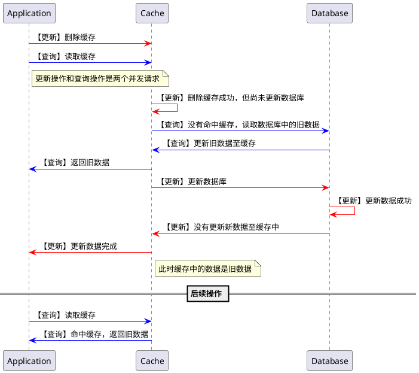
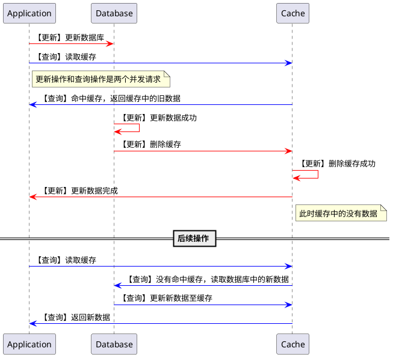

# 使用缓存的常见问题

## 缓存一致性

### 出现场景

更新缓存的时候，如果是 **先删除缓存，再更新数据库**，则可能会导致缓存数据和源数据不一致的。

出现问题的场景如下：

### 解决方案

使用缓存时，遵循 Cache Aside Pattern 模式，其具体逻辑如下：

- 失效：应用程序先从 Cache 获取数据，没有命中时从 Database 获取数据，并且在获取数据成功之后，保存至 Cache 中；
- 命中：应用程序从 Cache 获取数据，获取数据成功之后，直接返回；
- 更新：先更新数据至数据库中，更新成功之后，再删除 Cache 中的数据。

使用 Cache Aside Pattern 时，上述场景变更为：

### 参考资料

- [缓存更新的套路](https://coolshell.cn/articles/17416.html)

## 缓存穿透（不存在 key）

### 出现场景

如果应用程序一直查询未命中缓存的 key，那么查询请求便会一直访问数据库。

### 解决方案

从数据库中查询数据失败时，返回一个默认值，并设置相对短暂的失效时间，这样下次请求就会直接从缓存中获取这个默认值。

## 缓存雪崩（多个 key 失效）

### 出现场景

如果多个缓存的 key 同时失效，这样便会出现大量的未命中缓存的请求访问数据库。

### 解决方案

合理分布 key 的失效时间，例如在原有的失效时间上增加一个随机值。

## 缓存击穿（热点 key 失效）

### 出现场景

在高并发场景下，如果一个热点 key 失效，则会出现大量的并发请求访问数据库。

### 解决方案

#### 方案一

定期从数据库查询数据，并更新到缓存中。但是，对于某些动态拼接的 key，这种方案是无效的。

#### 方案二

对于热点 key，设置两个失效时间：一个是缓存即将失效的时间，另一个是真正的缓存失效时间。在缓存即将失效时，应用程序主动从数据库查询数据，并更新到缓存中。

值得注意的是，在缓存即将失效时，应用程序需要先加锁再访问数据库，避免出现并发访问数据库的场景。

对于热点 key 设置两个失效时间的方式如下：

1. 通过在设置 value 时追加当前时间戳。缺点：需要同步缓存服务器和应用服务器的时间、失效时间与 value 耦合（可能导致取数据的时候需要额外的反序列化）；
2. 通过设置两个 key 的方式。缺点：缓存中 key 的数量翻倍。
