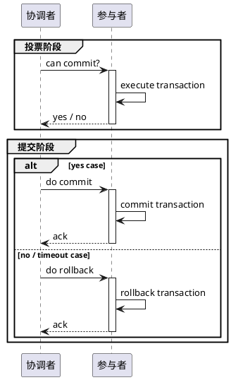
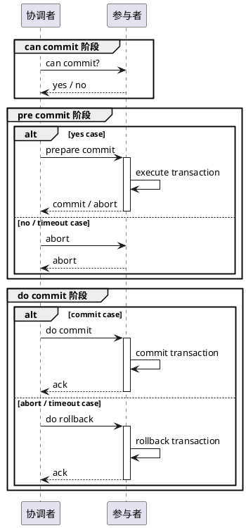

# 分布式事务协议：二阶段提交和三阶段提交

## 二阶段提交协议

### 算法步骤

投票阶段

1. 协调者向所有参与者询问是否可以执行事务 commit 操作，并（**阻塞**）等待所有参与者的响应；
2. 各个参与者执行事务操作至 commit 之前，并记录 undo 日志和 redo 日志；
3. 各个参与者回复协调者响应消息，事务执行成功 -> yes，事务执行失败 -> no。

提交阶段

情况一：所有参与者返回 yes

1. 协调者向所有参与者发送执行事务 commit 消息；
2. 各个参与者在收到消息之后执行事务 commit，并释放整个事务期间占用的资源；
3. 各个参与者在事务 commit 之后，回复协调者 ack 响应消息；
4. 协调者收到所有参与者 ack 消息之后，事务 commit 完成。

情况二：任意参与者返回 no，或者协调者等待超时

1. 协调者向所有参与者发送执行事务 rollback 消息；
2. 各个参与者在收到消息之后执行事务 rollback，并释放整个事务期间占用的资源；
3. 各个参与者在事务 rollback 之后，回复协调者 ack 响应消息；
4. 协调者收到所有参与者 ack 消息之后，事务 rollback 完成。

### 算法缺点

**同步阻塞**：已经通过第一阶段的参与者需要等待其它所有参与者响应，才能执行第二阶段。

**单点问题**：协调者宕机时会导致事务阻塞，参与者宕机时会导致数据不一致。

## 三阶段提交协议

### 算法步骤

can commit 阶段

1. 协调者向所有参与者发送 can commit 消息，并（**阻塞**）等待所有参与者的响应；
2. 各个参与者回复协调者响应消息，事务可以执行 -> yes，事务不可以执行 -> no。

pre commit 阶段

情况一：所有参与者返回 yes

1. 协调者向所有参与者发送 prepare commit 消息，并（**阻塞**）等待所有参与者的响应；
2. 各个参与者执行事务操作至 commit 之前，并记录 undo 日志和 redo 日志；
3. 各个参与者回复协调者响应消息，事务执行成功 -> commit，事务执行失败 -> abort。

情况二：任意参与者返回 no，或者协调者等待超时

1. 协调者向所有参与者发送中断事务消息；
2. 各个参与者回复协调者响应消息。

do commit 阶段

情况一：所有参与者返回 commit

1. 协调者向所有参与者发送 do commit 消息；
2. 各个参与者在收到消息之后执行事务 commit，并释放整个事务期间占用的资源；
3. 各个参与者在事务 commit 之后，回复协调者 ack 响应消息；
4. 协调者收到所有参与者 ack 消息之后，事务 commit 完成。

情况二：任意参与者返回 abort，或者协调者等待超时

1. 协调者向所有参与者发送 do rollback 消息；
2. 各个参与者在收到消息之后执行事务 rollback，并释放整个事务期间占用的资源；
3. 各个参与者在事务 rollback 之后，回复协调者 ack 响应消息；
4. 协调者收到所有参与者 ack 消息之后，事务 rollback 完成。

**异常情况**：协调者出现了问题，或者协调者和参与者之间的网络出现问题，导致了参与者无法接受消息

1. 参与者在等待超时之后执行事务 commit。

### 算法比较

相较于二阶段提交协议，三阶段提交协议 **降低了参与者的阻塞范围**，并且能够支持 **协调者在 do commit 阶段中出现单点问题时依旧保持数据一致**。

但是三阶段协议也是存在问题的，如果 **参与者在 do commit 阶段中出现单点问题时会导致数据不一致**。
