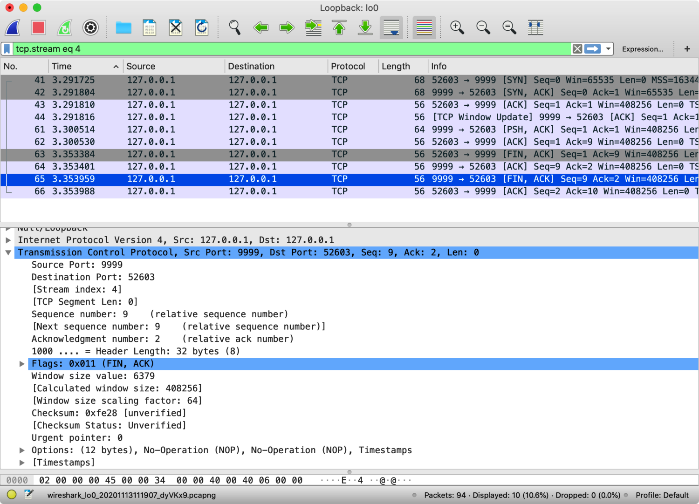

# TCP 连接管理

TCP 是面向连接的协议，连接的建立和释放是每一次 TCP 通信中必不可少的过程。TCP 对连接的管理主要有三个阶段：建立连接、数据传送、释放连接。

## 建立连接（三次握手）

```plain text
                                                     server
                                                 +------------+
   client                                        |CLOSED      |
+-----------+                                    |------------|
|CLOSED     |                                    |LISTEN      |
|-----------|--- SYN, seq=100 ------------------>|------------|
|           |                                    |            |
|SYN-SENT   |<------ SYN ACK, seq=300 ack=101 ---|SYN-RECEIVED|
|           |                                    |            |
|-----------|--- ACK, seq=101 ack=301 ---------->|------------|
|           |                                    |            |
|ESTABLISHED|--- ACK, seq=101 ack=301, [data] -->|ESTABLISHED |
|           |                                    |            |
+-----------+                                    +------------+
```

TCP 在建立连接的过程中需要解决以下三个问题：

1. 要使 client 和 server 都能确认对方的存在；
2. 要允许 client 和 server 能协商一些参数（例如最大窗口值等）；
3. 能够对传输资源（例如缓存大小）进行分配。

client 在接收到 server 的 SYN ACK 报文段之后，需要发送一次 ACK 报文段的目的是为了 **防止已失效的连接请求报文段突然又传送到了 server，继而产生错误**。


## 释放连接（四次挥手）

```plain text
   client                                       server
+-----------+                                +-----------+
|ESTABLISHED|                                |ESTABLISHED|
|-----------|--- FIN ACK, seq=100 ack=300 -->|-----------|
|FIN-WAIT-1 |                                |           |
|-----------|<------ ACK, seq=300 ack=101 ---|CLOSE-WAIT |
|           |                                |           |
|FIN-WAIT-2 |<-- FIN ACK, seq=300 ack=101 ---|-----------|
|           |                                |LAST-ACK   |
|-----------|--- ACK, seq=101 ack=301 ------>|-----------|
|TIME-WAIT  |                                |CLOSED     |
|-----------|                                +-----------+
|CLOSED     |
+-----------+
```

client 在接收到 server 的 FIN ACK 报文段之后，需要进入 TIME-WAIT 状态等待 2MSL 时间的目的是：

1. **保证 client 发送最后一个 ACK 报文段可以成功到达 server**；
2. 防止已失效的连接请求报文段出现在本连接中。





## 参考资料

- [RFC 793 - Transmission Control Protocol - Establishing a connection](https://tools.ietf.org/html/rfc793#section-3.4)
- [RFC 793 - Transmission Control Protocol - Closing a Connection](https://tools.ietf.org/html/rfc793#section-3.5)
